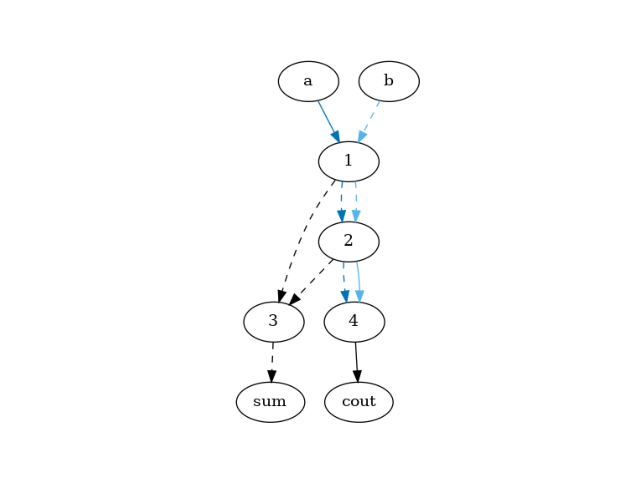
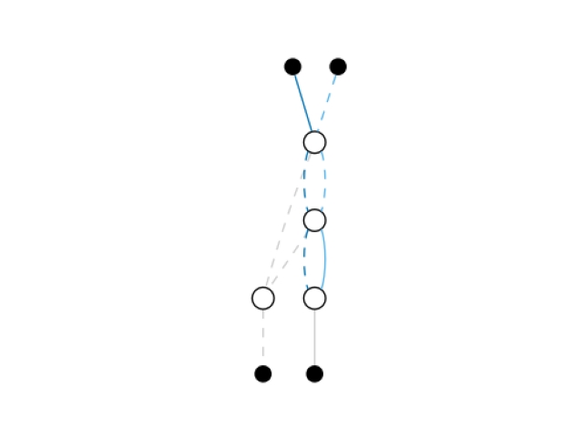

# Landauer
Python toolkit to support fundamental energy limits and reversible computing research

[](https://app.circleci.com/pipelines/github/mtdsousa/landauer)


## Install
Installing this Python package:
```
python3 -m pip install landauer
```

## Modules

### Parse
Parses a hardware description file (written using a Verilog subset) and returns an and-inverter graph (as an instance of NetworkX DiGraph):
```python
import landauer.parse as parse
half_adder = '''
    module half_adder (a, b, sum, cout);
        input a, b;
        output sum, cout;

        assign sum = a ^ b;
        assign cout = a & b;
    endmodule
'''
aig = parse.parse(half_adder)
print(aig)
# DiGraph with 8 nodes and 10 edges
```
> You can enable majority-gates support using the switch `--majority_support`. In this case the output is an AIG superset where a node with three inputs (e.g. a, b, and c) is equivalent to `(a & b) | (a & c) | (b & c)`.

> Verilog subset supported: Single module description. Restricted to `input`, `output`, and `wire` declarations (registers nor arrays are supported).

You can also use this module via the command line. The output is a JSON-serialized NetworkX DiGraph in an adjacency format:

```bash
cat << EOF | python -m landauer.parse --stdin
module half_adder (a, b, sum, cout);
        input a, b;
        output sum, cout;

        assign sum = a ^ b;
        assign cout = a & b;
    endmodule
EOF
# {"directed": true, "multigraph": false, "graph": [], "nodes": [{"id": "a"}, {"id": 1}, {"id": "b"}, {"id": 2}, {"id": 3}, {"id": "sum"}, {"id": 4}, {"id": "cout"}], "adjacency": [[{"inverter": false, "id": 1}, {"inverter": true, "id": 2}, {"inverter": false, "id": 4}], [{"inverter": true, "id": 3}], [{"inverter": true, "id": 1}, {"inverter": false, "id": 2}, {"inverter": false, "id": 4}], [{"inverter": true, "id": 3}], [{"inverter": true, "id": "sum"}], [], [{"inverter": false, "id": "cout"}], []]}
```

### Entropy

Simulates the design for all possible inputs and calculates the entropy for some specific signal sets. We can list the following sets for each gate: inputs, output, and every output-input combination.

```python
import landauer.parse as parse
import landauer.entropy as entropy

half_adder = '''
    module half_adder (a, b, sum, cout);
        input a, b;
        output sum, cout;

        assign sum = a ^ b;
        assign cout = a & b;
    endmodule
'''
entropy_database = entropy.entropy(parse.parse(half_adder))
print(entropy_database)
# {frozenset({'b', 'a'}): 2.0, frozenset({1}): 0.8112781244591328, frozenset({1, 'b'}): 1.5, frozenset({1, 'a'}): 1.5, frozenset({1, 'b', 'a'}): 2.0, frozenset({2}): 0.8112781244591328, frozenset({2, 'b'}): 1.5, frozenset({2, 'a'}): 1.5, frozenset({2, 'b', 'a'}): 2.0, frozenset({4}): 0.8112781244591328, frozenset({'b', 4}): 1.5, frozenset({4, 'a'}): 1.5, frozenset({'b', 4, 'a'}): 2.0, frozenset({1, 2}): 1.5, frozenset({3}): 1.0, frozenset({1, 3}): 1.5, frozenset({2, 3}): 1.5, frozenset({1, 2, 3}): 1.5}
```
> The output is a Python dictionary where the key is the signal set (as a Python `frozenset`), and the value is the entropy (in bits).

You can also use this module via the command line:
```bash
cat << EOF | python -m landauer.parse --stdin | python -m landauer.entropy --stdin
module half_adder (a, b, sum, cout);
        input a, b;
        output sum, cout;

        assign sum = a ^ b;
        assign cout = a & b;
    endmodule
EOF
# [{"variables": ["a", "b"], "entropy": 2.0}, {"variables": [1], "entropy": 0.8112781244591328}, {"variables": [1, "a"], "entropy": 1.5}, {"variables": [1, "b"], "entropy": 1.5}, {"variables": [1, "a", "b"], "entropy": 2.0}, {"variables": [2], "entropy": 0.8112781244591328}, {"variables": [2, "a"], "entropy": 1.5}, {"variables": [2, "b"], "entropy": 1.5}, {"variables": [2, "a", "b"], "entropy": 2.0}, {"variables": [4], "entropy": 0.8112781244591328}, {"variables": ["a", 4], "entropy": 1.5}, {"variables": [4, "b"], "entropy": 1.5}, {"variables": ["a", 4, "b"], "entropy": 2.0}, {"variables": [1, 2], "entropy": 1.5}, {"variables": [3], "entropy": 1.0}, {"variables": [1, 3], "entropy": 1.5}, {"variables": [2, 3], "entropy": 1.5}, {"variables": [1, 2, 3], "entropy": 1.5}]
```

### Evaluate
Calculates the total entropy loss and losses for each gate given circuit and its simulation data.

```python
import landauer.parse as parse
import landauer.entropy as entropy
import landauer.evaluate as evaluate

half_adder = '''
    module half_adder (a, b, sum, cout);
        input a, b;
        output sum, cout;

        assign sum = a ^ b;
        assign cout = a & b;
    endmodule
'''
aig = parse.parse(half_adder)
entropy_database = entropy.entropy(aig)
evaluation = evaluate.evaluate(aig, entropy_database)
print(evaluation)
# {'gates': {1: 1.188721875540867, 2: 1.188721875540867, 3: 0.5, 4: 1.188721875540867}, 'total': 4.066165626622601}
```

> You may provide an optimized circuit instead (check `Naive` module below). However, you should provide the simulation result from the original circuit.

You can also use this module via the command line:
```bash
cat << EOF > half_adder.v  
module half_adder (a, b, sum, cout);
        input a, b;
        output sum, cout;

        assign sum = a ^ b;
        assign cout = a & b;
    endmodule
EOF
python -m landauer.parse --file half_adder.v > half_adder.json
python -m landauer.entropy --file half_adder.v > entropy_database.json
python -m landauer.evaluate entropy_database.json --file half_adder.json
# {"total": 4.066165626622601, "gates": [{"gate": 1, "loss": 1.188721875540867}, {"gate": 2, "loss": 1.188721875540867}, {"gate": 3, "loss": 0.5}, {"gate": 4, "loss": 1.188721875540867}]}
```

### Naive
Optimizes the circuit using the heuristics from "CHAVES, J. et all. Designing Partially Reversible Field-Coupled Nanocomputing Circuits. IEEE Transactions on Nanotechnology, Volume 18, 2019." There are two strategies: The first one is more conservative and doesn't change the circuit depth (delay-oriented). The second one is more aggressive and may change the circuit depth. However, this last one (energy-oriented) leverages better energy optimization.

```python
import landauer.parse as parse
import landauer.entropy as entropy
import landauer.evaluate as evaluate
import landauer.naive as naive

half_adder = '''
    module half_adder (a, b, sum, cout);
        input a, b;
        output sum, cout;

        assign sum = a ^ b;
        assign cout = a & b;
    endmodule
'''

aig = parse.parse(half_adder)
entropy_database = entropy.entropy(aig)
print(evaluate.evaluate(aig, entropy_database))
# 4.066165626622601

delay_oriented = naive.naive(aig, naive.Strategy.DELAY_ORIENTED)
print(evaluate.evaluate(delay_oriented, simulation))
# 4.066165626622601

energy_oriented = naive.naive(aig, naive.Strategy.ENERGY_ORIENTED)
print(evaluate.evaluate(energy_oriented, simulation))
# 1.688721875540867
```

> Please notice that the delay-oriented strategy couldn't find any opportunity to propagate inputs (to avoid information/entropy losses). On the other hand, the energy-oriented heuristic reduced the entropy losses from 4.07 to 1.69.

You can also use this module via command line. The output is a JSON-serialized NetworkX MultiDiGraph in an adjacency format.
```bash
cat << EOF > half_adder.v  
module half_adder (a, b, sum, cout);
        input a, b;
        output sum, cout;

        assign sum = a ^ b;
        assign cout = a & b;
    endmodule
EOF
python -m landauer.parse --file half_adder.v > half_adder.json
python -m landauer.entropy --file half_adder.v > entropy_database.json
python -m landauer.evaluate entropy_database.json --file half_adder.json
python -m landauer.naive energy_oriented --file half_adder.json
# {"directed": true, "multigraph": true, "graph": [], "nodes": [{"level": 0, "id": "a"}, {"level": 1, "id": 1}, {"level": 0, "id": "b"}, {"level": 2, "id": 2}, {"level": 3, "id": 3}, {"level": 4, "id": "sum"}, {"level": 3, "id": 4}, {"level": 4, "id": "cout"}], "adjacency": [[{"inverter": false, "id": 1, "attributes": {"color": "#0173b2"}, "key": 0}], [{"inverter": true, "id": 3, "key": 0}, {"forward": true, "inverter": true, "attributes": {"color": "#0173b2"}, "id": 2, "key": "a"}, {"forward": true, "inverter": true, "attributes": {"color": "#56b4e9"}, "id": 2, "key": "b"}], [{"inverter": true, "id": 1, "attributes": {"color": "#56b4e9"}, "key": 0}], [{"inverter": true, "id": 3, "key": 0}, {"forward": true, "inverter": true, "attributes": {"color": "#0173b2"}, "id": 4, "key": "a"}, {"forward": true, "inverter": false, "attributes": {"color": "#56b4e9"}, "id": 4, "key": "b"}], [{"inverter": true, "id": "sum", "key": 0}], [], [{"inverter": false, "id": "cout", "key": 0}], []]}

```

### Graph
Generates a DOT file given an and-inverter graph. There are two visualization modes: `default` and `paper`. Input propagations are represented by colored edges. Inverters are represented by dashed edges.

```python
import landauer.parse as parse
import landauer.naive as naive
import landauer.graph as graph

half_adder = '''
    module half_adder (a, b, sum, cout);
        input a, b;
        output sum, cout;

        assign sum = a ^ b;
        assign cout = a & b;
    endmodule
'''

aig = parse.parse(half_adder)
energy_oriented = naive.naive(aig, naive.Strategy.ENERGY_ORIENTED)
print(graph.default(energy_oriented))
# digraph {
#	a
#	1
#	b
#	2
#	3
#	sum
#	4
#	cout
#	a -> 1 [color="#0173b2" style=solid]
#	1 -> 3 [style=dashed]
#	1 -> 2 [color="#0173b2" style=dashed]
#	1 -> 2 [color="#56b4e9" style=dashed]
#	b -> 1 [color="#56b4e9" style=dashed]
#	2 -> 3 [style=dashed]
#	2 -> 4 [color="#0173b2" style=dashed]
#	2 -> 4 [color="#56b4e9" style=solid]
#	3 -> sum [style=dashed]
#	4 -> cout [style=solid]
#}
```
You can call the method `show` to display the graph using `matplotlib`:
```python
graph.show(graph.default(energy_oriented))
```


You can also use this module via command line:
```bash
cat << EOF | python -m landauer.parse --stdin | python -m landauer.naive energy_oriented --stdin | python -m landauer.graph --type paper --stdin --show
module half_adder (a, b, sum, cout);
        input a, b;
        output sum, cout;

        assign sum = a ^ b;
        assign cout = a & b;
    endmodule
EOF
```

